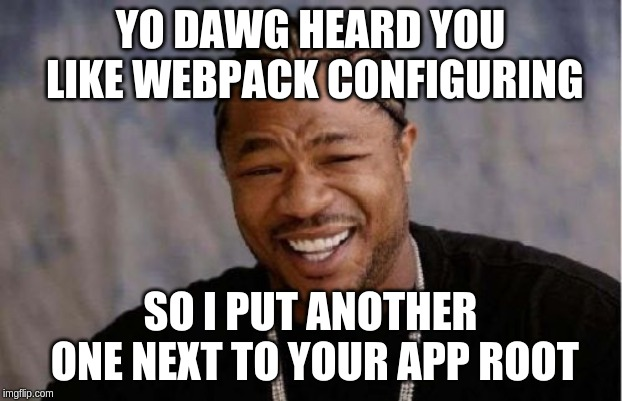

# Adding Storybook

---
# Adding Storybook


> [Storybook](https://github.com/storybooks/storybook) is a development environment for UI components. 
> It allows you to browse a component library, view the different states of each component, 
> and interactively develop and test components.

---
# Adding Storybook

Add a couple of packages... 😏
```bash
npm install -g @storybook/cli
yarn add --dev @storybook/react @storybook/addon-knobs @storybook/addon-viewport \
    @storybook/addon-options storybook-readme ts-loader  @types/node @types/react \
    @types/react-dom @types/react-helmet @types/react-redux @types/storybook__addon-actions \
    @types/storybook__addon-knobs @types/storybook__addon-options @types/storybook__react
```

---
# Adding Storybook

Init CLI installation wizard and go through a several simple questions
```bash
cd my-awesome-gatsby-project
sb init
```

[Nice tutorial](https://www.gatsbyjs.org/docs/visual-testing-with-storybook/) is available on the gatsby main website.

---
## Adding Storybook
# Bring me the configuration


---
## Adding Storybook
<video controls autoplay>
  <source src="R-gatsby-talk-12-storybook.mkv" type="video/mp4">
Your browser does not support the video tag.
</video>


---
## Adding Storybook
# Can be even better!

One could easily track visual changes of components:
* Write stories
* Make screenshots automatically 
* Compare with the previous versions — _visually_

---
# Storybook: Automatic tools
## Loki
[Loki](https://github.com/oblador/loki) allows you to create the reference images to test your stories against. 
These images should be checked into your git repository, optionally stored using `git-lfs`. 

**Slower, screenshots stored locally, free**.

## Chromatic
[Chromatic](https://docs.chromaticqa.com/) is a Storybook addon that automatically turns your stories into visual test specifications.
The addon uploads your Storybook bundle to **cloud** infrastructure where your tests run in parallel in a consistent browser environment.

**Faster, paid, no need for screenshots stored in repository.**


