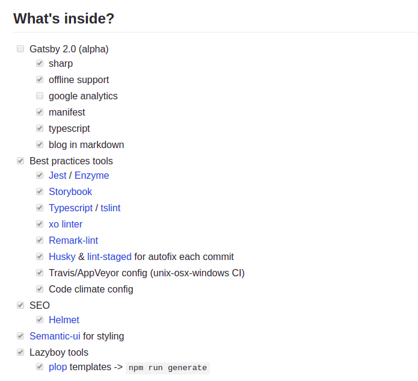

## The short way
# Starters!

> Starters are Gatsby sites that are preconfigured for different use cases to give you a head start for your project.

---
## The short way
# Starters!

* [Gallery of starters available](https://www.gatsbyjs.org/starters/?v=2) 
* [Gatsby 2.0 starter](https://github.com/fabien0102/gatsby-starter)

---
## The short way
# Starters!

Gatsby 2.0 starter contain:

---
# Have fun with Gatsby!

## The End
